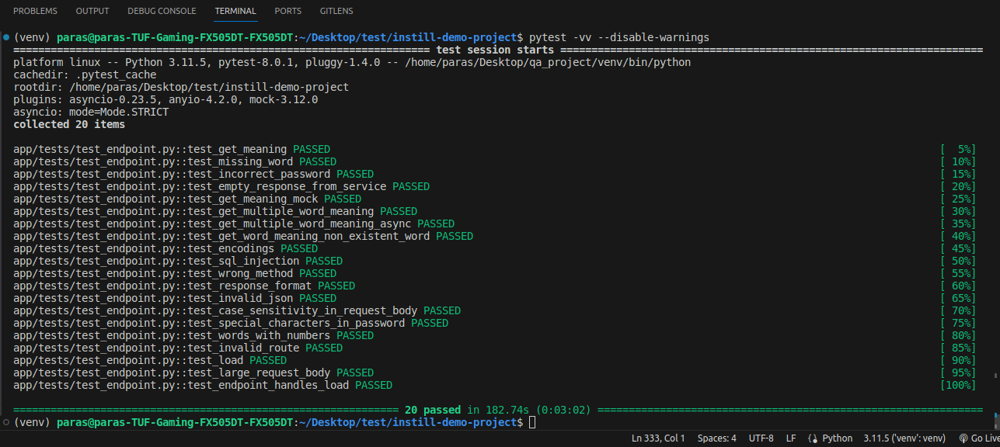

# Dictionary Endpoint Testing and Bug Report

## Introduction
This document serves as a guide for testing the dictionary endpoint and contains a bug report for identified issues in the code. It outlines the test cases implemented, instructions on running the tests, and details on encountered bugs.

## Manual Testing Documentation

[Instill Flow Manual QA Test Cases](https://docs.google.com/spreadsheets/d/14Z2afhiWXEfihZJg5iiKgQSg2F1kl5vyoXOdFXEE-B0/edit?usp=sharing)

This spreadsheet contains a comprehensive set of manual test cases for the Instill Flow feature. Each test case is designed to validate different aspects of the feature's functionality. Test cases are organized by their Test Case ID, Description, Test Steps, Expected Result, Actual Result, and Pass/Fail status.

Feel free to use this document for manual testing of the Instill Flow feature.

## Automation Test Cases

### Test Fixtures:

#### Client Fixture

The `client` fixture provides a FastAPI TestClient instance for testing HTTP endpoints.

#### Dictionary Service Fixture

The `mock_dictionary_service` fixture provides a mocked instance of DictionaryService for testing.

### Test Cases Overview:

#### `test_get_meaning`

Description: Verify the functionality of retrieving the meaning of a single word from the dictionary endpoint.

#### `test_missing_word`

Description: Check the handling of a request without providing any words.

#### `test_incorrect_password`

Description: Validate the behavior when an incorrect password is provided.

#### `test_special_characters_in_word`

Description: Verify the handling of special characters in password.

#### `test_empty_response_from_service`

Description: Verify the handling of an empty response from the dictionary service.

#### `test_get_word_meaning_non_existent_word`

Description: Validate the handling of a non-existent word.

#### `test_wrong_method`

Description: Validate the handling of requests using the wrong HTTP method.

#### `test_encoding`

Description: Verify the handling of special characters in word.

#### `test_get_meaning_mock`

Description: Check the functionality of retrieving the meaning of a word using a mocked dictionary service.

#### `test_get_multiple_word_meaning`

Description: Test the retrieval of meanings for multiple words simultaneously.

#### `test_get_multiple_word_meaning_async`

Description: Test the retrieval of meanings for multiple words simultaneously asynchronously.

#### `test_words_with_numbers`

Description: Verify the handling of words containing numbers.

#### `test_invalid_route`

Description: Check the handling of requests to an invalid route.

#### `test_invalid_json`

Description: Validate the handling of requests with invalid JSON payloads.

#### `test_large_request_body`

Description: Check the handling of requests with large JSON payloads.

#### `test_response_format`

Description: Verify the response format of the endpoint.

#### `test_case_sensitivity_in_request_body`

Description: Verify the handling of case sensitivity in the request body.

#### `test_sql_injection`

Description: Verify the handling of SQL injection attacks.

#### `test_endpoint_handles_load_async`

Description: Validate the endpoint's ability to handle a high load of requests concurrently asynchronously.

#### `test_load`

Description: Validate the endpoint's ability to handle a high load of requests concurrently.

## Bug Report

### Identified Bugs:

During the testing process, the following bugs were identified:

1. **Validation Error**: Occasionally, validation errors such as `ResponseValidationError` were encountered while running certain tests. These errors occurred unexpectedly and impacted the test results. Further investigation is required to understand the root cause of these validation errors and address them accordingly.

   - **Affected Test Cases**: `test_case_sensitivity_in_request_body`, `test_endpoint_handles_load_async`, etc.

2. **Validation Error for Non-Existent Words**: When multiple words are sent to the endpoint, and one of them does not exist in the dictionary, the endpoint returns a `422 Unprocessable Entity` error without providing any meaning for the existing words. This behavior is inconsistent with the expected functionality, where meanings for existing words should still be returned despite the presence of a non-existent word in the request.

   - **Affected Test Cases**: `test_get_word_meaning_non_existent_word`


3. **Incorrect Handling of Special Characters**: The endpoint does not handle words containing special characters properly. When a word with special characters is sent to the endpoint, it raises a `ResponseValidationError` with status code `422 Unprocessable Entity`, indicating a failure to process the request.

   - **Affected Test Case**: `test_encodings`

4. **Load Handling Issue with Large Words**: The endpoint failed to handle a high load of requests concurrently when large words were included in the request payload. This resulted in unexpected behavior and test failures. Additional optimizations may be necessary to improve the endpoint's performance under heavy loads.

   - **Affected Test Cases**: `test_large_request_body`, `test_load`
`

## Prerequisites

Python environment with required dependencies installed.
Instructions:

Clone the repository and navigate to the project directory.
Install dependencies using:
```bash
pip install -r requirements.txt.
```
Run the server:
```bash
python3 start_server.py
```
Run the tests using a testing framework such as Pytest:

```bash
pytest -vv --disable-warnings
```

Screenshots of test run:


## Note on Test Execution

It's important to note that due to the nature of the tests and potential environmental factors, test results may vary across different environments. If a test fails unexpectedly, consider rerunning the test multiple times to ensure consistency. You can also run tests one by one for better control and consistency:

```bash
pytest -vv -k test_function_name
```

Additionally, when the synchronous function of the dictionary service is commented out, only two specific tests (`test_get_meaning_mock` and `test_empty_response_from_service`) won't work as expected. Ensure that these tests are properly handled or accounted for when making changes to the dictionary service implementation.

## Conclusion
The provided test cases cover various scenarios to ensure the functionality and reliability of the dictionary endpoint. By addressing the identified bugs and running the tests, we can verify that the endpoint behaves as expected under different conditions.